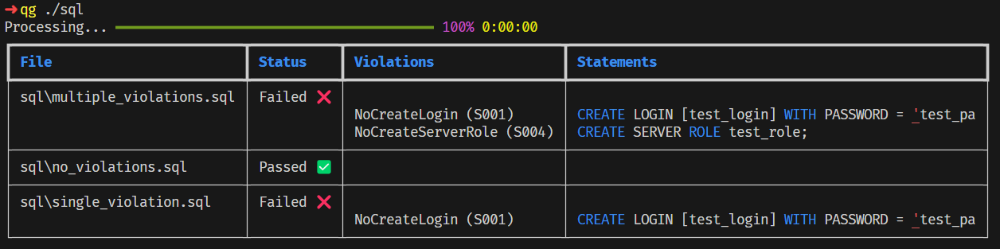

<p align="center">
    <em>A guard against unruly sql.</em>
</p>
<p align="center">

[](https://github.com/dataNdeadlifts/QueryGuard/actions/workflows/test.yml)
[](https://codecov.io/github/dataNdeadlifts/QueryGuard)

---

**Documentation**:

**Source Code**: <a href="https://github.com/dataNdeadlifts/QueryGuard" target="_blank">https://github.com/dataNdeadlifts/QueryGuard</a>

---

QueryGuard is a command line tool for analyzing SQL queries for best practices and adherance to security policies.

It functions very similarly to static analysis tools for other programing languages such as flake8, ruff, and ESLint but for your database queries.


## Requirements

Python 3.9+


## Installation

<div class="termy">

```console
$ pip install "QueryGuard"
---> 100%
Successfully installed QueryGuard
```

</div>


## Example

### Check all sql files in a folder



### Ignore a specific rule


## License

This project is licensed under the terms of the Apache 2.0 license.
